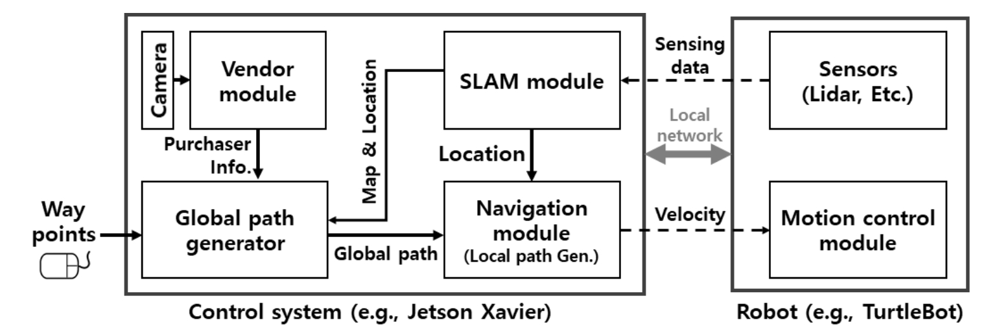
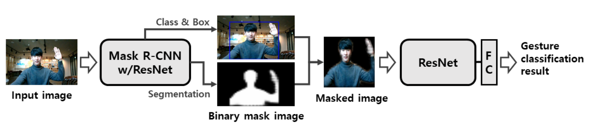
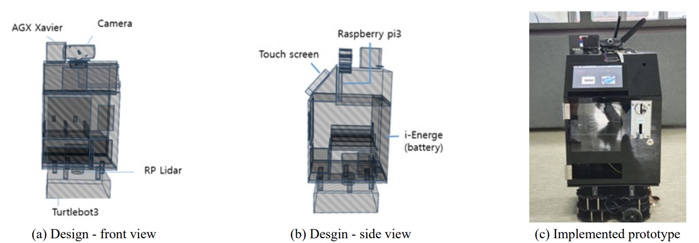
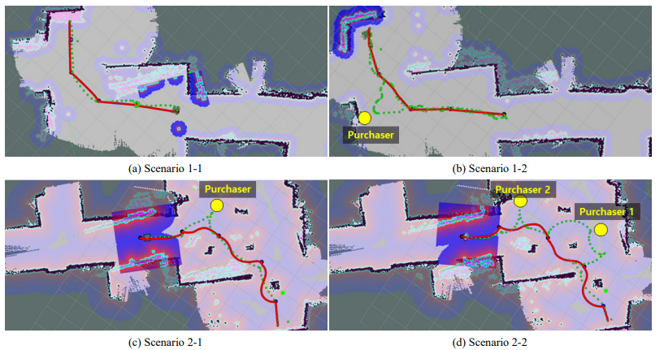
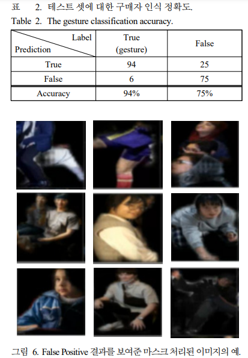

# 자율 주행 로봇 자판기 설계 및 구현
수행 기간: (2020.06 - 2021.06)  

## 프로젝트
- '자율 주행 로봇'은 로봇을 효율적으로 활용할 수 있는 무인 판매 시스템을 위한 프로토 타입의 구현입니다.
- 딥러닝 기반 구매자 인식 기능을 탑재한 로봇은 정해진 경로를 자율 주행하며, 판매를 수행합니다.
- 본 프로젝트는 2021년 6월에 출간된 제어 로봇 시스템 학회 논문지 411-117 페이지에서 확인할 수 있습니다.

## 수행 과제
### 1. ROS 통신을 기반으로 한 자율 주행 판매 시스템 설계
- ROS melodic을 사용하여 메시지 기반으로 총 5가지 모듈이 독립적으로 기능을 수행하며 전체적인 시스템을 구성
  - Vending: 사용자에게 자판기 기능 제공   
  - SLAM: 전체 경로 설정 및 현재 위치 정보 탐색   
  - Global path generator: 전체 경로에 따라 사용자가 설정한 임의의 범위에 따라 주행할 경로를 탐색 
  - Navigation Module: 장애물 탐지에 따른 실제로 주행할 경로 탐색 및 속력 결정 
  - Motion Control: 전달받은 속력값에 따른 실제 로봇을 주행  

  
### 2. 모바일 로봇에 최적화 된 딥러닝 기반 구매자 인식 기능 구현
- Mask R-CNN 미세조정 모듈을 통한 사람 마스크 이미지 생성
- Resnet pretrained 모델 기반의 이진 분류로 구매자 인식 기능 구현
### 3. 물리적인 하드웨어의 설계
- 컴퓨팅 디바이스
  - 라즈베리 파이: 자판기 판매 기능을 위한 UI 및 스텝모터를 연동하여 판매 기능 수행
  - Jetson Xavier: 전체적인 ROS 시스템 환경 제공 및 판매를 제외한 모든 컴퓨팅 수행
- 로봇의 높이를 포함한 규격 설계
- 실제 주행 테스트를 수행하며 무게 중심 조정
- 딥러닝 인식을 위한 카메라 위치 설정

## 기여 부분
- 딥런닝 기반 구매자 인식 기능 구현
  - 미리 학습된 Mask R-CNN 모델과 오픈 소스를 이용하여 파인튜닝 과정을 거쳐 사람에 대한 마스크 이미지 생성
  - 미리 학습된 Resnet 모델에 FC layer를 결합시켜 손을 든 사람 구분 모델 구현
  

- ROS 통신을 기반으로 한 자율 주행 판매 시스템 설계
  - ROS 기반 메시지 기반 통신으로 SLAM, Global path, Navigation 통신 구현
  - REST 통신으로 구매자 인식을 포함한 판매자 정보와 시스템을 연결
  - 각각의 모듈을 노드단위로 분리하여 구현할 수 있는 ROS 통신 기반의 프로젝트 수행으로 작업의 종속성을 효과적으로 줄임
  - 전체적으로 시스템을 연결하면서 생긴 문제들을 처리(local Network issue.. etc)

## 결과
<table style="border:none;">
<tr><td>

</td></tr>
<tr><td>

</td></tr>
<tr><td>

</td></tr>
</table>

## 
- 

## Tech Stack
- **ROS melodic** : 전체적인 시스템 메시지 기반 통신
- **Python:pytorch** : 딥러닝 기반 구매자 인식 기능 구혆을 위해 GPU를 이용한 행렬 연산을 지원하는 파이썬 라이프러리
- **javascript**: 판매정보 전달을 위한 REST 통신을 위해서 사용
- **python:PyQt**: 물품 판매를 위한 GUI를 사용하기 위한 파이썬 라이브러리

&emsp;사용 오픈소스

- Mask R-CNN Pretrained Model
- Resnet Pretrained Model

